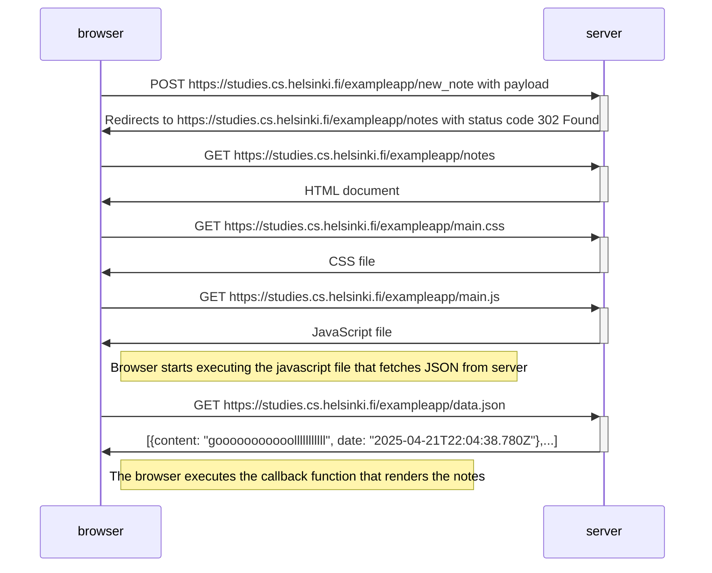

```mermaid
sequenceDiagram
    browser->>+server: POST https://studies.cs.helsinki.fi/exampleapp/new_note with payload
    server->>-browser: Redirects to https://studies.cs.helsinki.fi/exampleapp/notes with status code 302 Found
    browser->>+server: GET https://studies.cs.helsinki.fi/exampleapp/notes
    server->>-browser: HTML document
    browser->>+server: GET https://studies.cs.helsinki.fi/exampleapp/main.css
    server->>-browser: CSS file
    browser->>+server: GET https://studies.cs.helsinki.fi/exampleapp/main.js
    server->>-browser: JavaScript file
    Note right of browser : Browser starts executing the javascript file that fetches JSON from server
    browser->>+server: GET https://studies.cs.helsinki.fi/exampleapp/data.json
    server->>-browser: [{content: "gooooooooooolllllllllll", date: "2025-04-21T22:04:38.780Z"},...]
    Note right of browser : The browser executes the callback function that renders the notes
```
