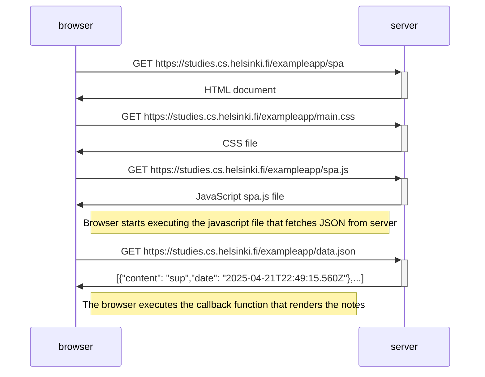

```mermaid
sequenceDiagram
    browser->>+server: GET https://studies.cs.helsinki.fi/exampleapp/spa
    server->>-browser: HTML document
    browser->>+server: GET https://studies.cs.helsinki.fi/exampleapp/main.css
    server->>-browser: CSS file
    browser->>+server: GET https://studies.cs.helsinki.fi/exampleapp/spa.js
    server->>-browser: JavaScript spa.js file
    Note right of browser : Browser starts executing the javascript file that fetches JSON from server
    browser->>+server: GET https://studies.cs.helsinki.fi/exampleapp/data.json
    server->>-browser: [{"content": "sup","date": "2025-04-21T22:49:15.560Z"},...]
    Note right of browser : The browser executes the callback function that renders the notes
```
